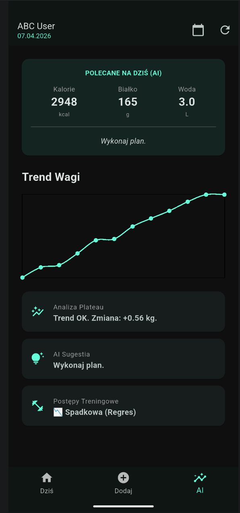
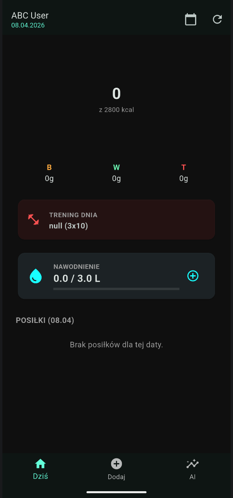
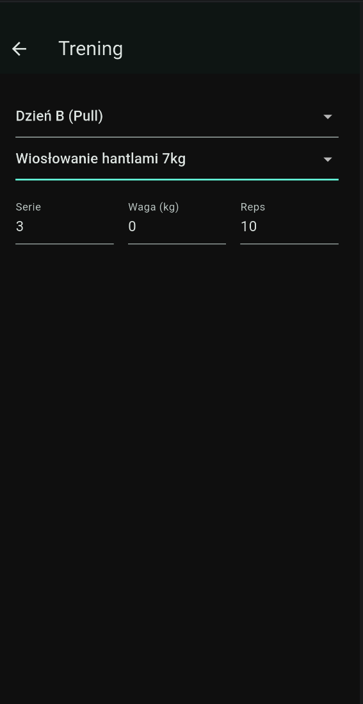
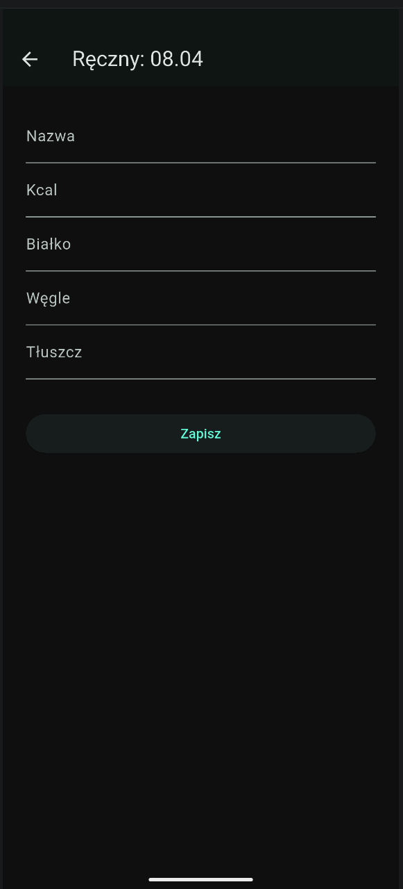
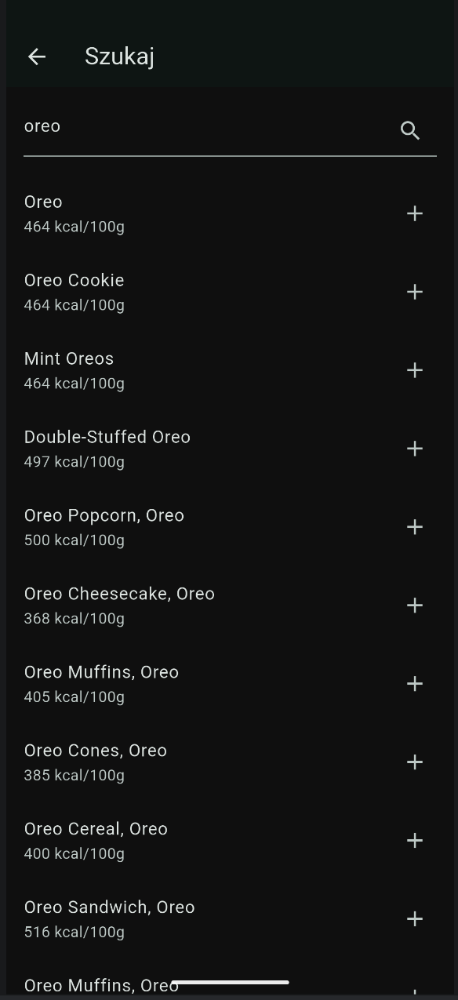
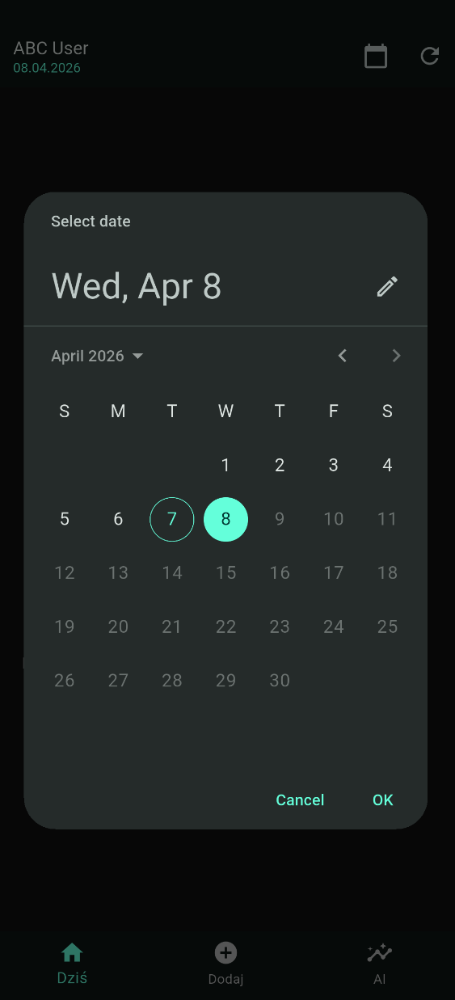
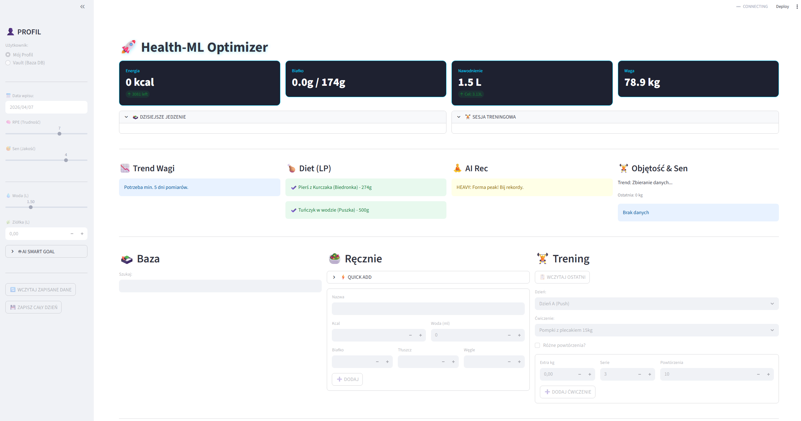

# 🚀 Health & Sport Machine Learning Optimizer

[](https://fastapi.tiangolo.com/)
[](https://flutter.dev/)
[](https://streamlit.io/)
[](https://www.python.org/)
[](https://opensource.org/licenses/MIT)

**Zaawansowany ekosystem do monitorowania postępów sportowych, diety oraz optymalizacji procesów przy użyciu modeli matematycznych i Machine Learning.**

---

## 📸 Screenshots & Gallery

<p align="center">
  
  
  
</p>

<p align="center">
  
  
  
</p>

<p align="center">
  
</p>

---

## 🏗️ Architektura Systemu

Projekt to zintegrowane środowisko składające się z trzech głównych filarów:

*   🖥️ **Web Dashboard (Streamlit)**: Centrum dowodzenia z pełną analityką ML, prognozowaniem trendów i optymalizacją diety.
*   ⚡ **Backend API (FastAPI)**: Produkcyjne serce systemu obsługujące autoryzację (JWT), synchronizację danych i logikę ML.
*   📱 **Mobile App (Flutter)**: Nowoczesna aplikacja na iOS/Android z logowaniem, interaktywnym śledzeniem nawodnienia i szybkim podglądem postępów.

---

## ⚡ Szybki Start (Windows)

Uruchom cały system jednym kliknięciem:

1.  **Metoda 1 (Automatyczna)**: Kliknij dwukrotnie plik **`start_health_ml.bat`**.
2.  **Metoda 2 (Terminal)**: 
    ```powershell
    py run_project.py
    ```

**Skrypt automatycznie:**
*   Weryfikuje i instaluje zależności `pip`.
*   Uruchamia **Backend API** (port 8000) z funkcją *hot-reload*.
*   Uruchamia **Web Dashboard** (port 8501).
*   Wykrywa emulatory Flutter i proponuje uruchomienie wersji mobilnej lub desktopowej.

---

## 🌟 Kluczowe Funkcje AI & ML

| Funkcja | Opis Techniczny |
| :--- | :--- |
| **AI SMART GOAL** | Dynamiczne wyliczanie zapotrzebowania kcal i białka (Mifflin-St Jeor + PAL). |
| **Diet Optimizer** | Precyzyjne dobieranie posiłków za pomocą programowania liniowego (`scipy.optimize`). |
| **Weight Forecast** | Prognozowanie wagi i wykrywanie zastojów (**Plateau Detection**) przy użyciu **Facebook Prophet**. |
| **Training Insights** | Automatyczne obliczanie tonażu (objętości) treningowej na podstawie logów tekstowych (Regex Parser). |
| **AI Recommendation** | Sugestie treningowe bazujące na regeneracji (korelacja Pearsona: sen vs. siła). |
| **Smart Hydration** | Cel nawodnienia liczony dynamicznie: $Waga \times 0.033 + \text{Activity Bonus}$. |

---

## 📱 Mobile App Features
*   **Bezpieczeństwo**: Hybrydowe hashowanie **SHA256 + BCrypt** (bezpieczeństwo klasy enterprise).
*   **Integracja API**: Bezpośrednie wyszukiwanie produktów przez **Edamam API**.
*   **Tryb Offline**: Lokalna baza **SQLite** (`health_vault.db`) do utrwalania danych.
*   **UX**: Interaktywne suwaki, tryb ciemny i błyskawiczna synchronizacja.
*   **Dystrybucja**: Szczegóły w [MOBILE_RELEASE.md](MOBILE_RELEASE.md).

---

## 🧠 Dokumentacja Modeli

### 1. Optymalizacja Diety (LP)
Wykorzystuje solver `highs` (`scipy.optimize.linprog`) do minimalizacji nadmiaru kcal przy rygorystycznym zachowaniu minimum białkowego.

### 2. Prognozowanie Trendów (Prophet)
Analiza szeregów czasowych wykrywająca sezonowość. Sugeruje **Refeed Day**, gdy zmiana wagi wynosi $< 0.2\text{ kg}$ w ciągu 14 dni.

### 3. Analiza Objętości (Workout ML)
*   **Parser**: Wyciąga tonaż z zapisów typu `(3x15.0kg x 12,10,8)`.
*   **Korelacja**: Bada statystyczny wpływ jakości snu na wydolność (RPE).

### 4. Skala RPE (Rate of Perceived Exertion)
*   **10**: Max wysiłek (RIR 0).
*   **9**: 1 powtórzenie w zapasie (RIR 1).
*   **8**: 2 powtórzenia w zapasie (RIR 2).
*   **7**: Solidny trening, pełna kontrola.
*   **1-5**: Rozgrzewka / Regeneracja.

---

## 🛠️ Rozwiązywanie problemów

### Autoryzacja & Baza Danych
Jeśli napotkasz błędy logowania (konflikt `passlib` na Python 3.12+):
1.  System używa natywnej biblioteki `bcrypt`.
2.  Użyj **`fix_db.py`**, aby zresetować hasło dla administratora (`admin@test.pl`).

### Dane Testowe
Konto testowe: `abc@gmail.com` / Hasło: `123`

---

## 📈 Poprawki User-Centric (Log zmian)
*   ✅ **Multi-User Vault**: Przejście na relacyjną bazę danych SQLite.
*   ✅ **Mixed Reps Logging**: Wsparcie dla zapisów typu `12,10,8`.
*   ✅ **Load Last Workout**: Szybkie kopiowanie poprzednich sesji.
*   ✅ **UI/UX Fix**: Kontrastowe czcionki i optymalizacja `Tab` w formularzach.
*   ✅ **Advanced Hydration**: Uwzględnienie ziół (90% wartości wody) i posiłków płynnych.

---

*Projekt rozwijany z myślą o maksymalnej efektywności treningowej i dietetycznej.*
